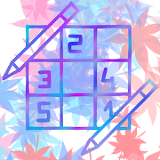
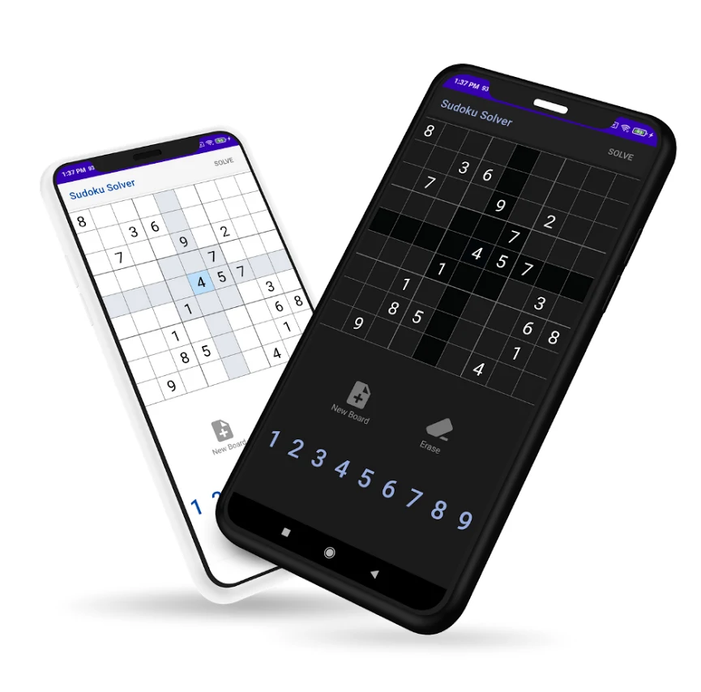
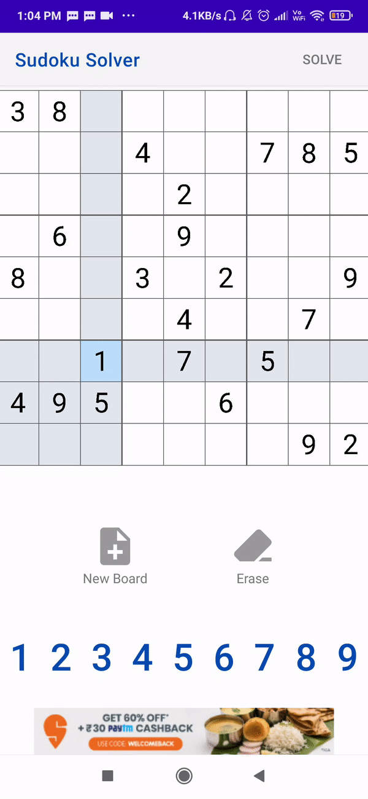

# SudokuSolver

This android app allows users to solve any sudoku puzzle in less than a second. 

  
  

## Screenshots

## About

- The app follows the MVVM architecture pattern. 
- The sudoku board is a custom view. The puzzle is solved using a backtracking algorithm.
